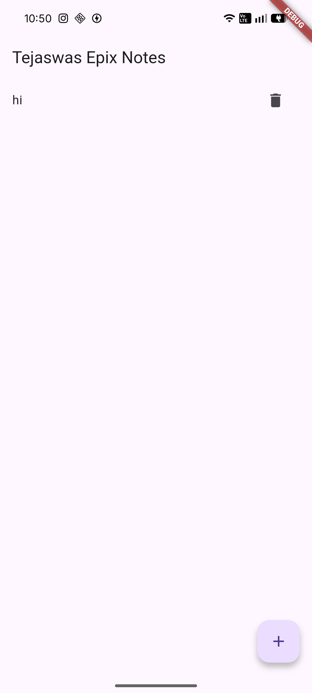

# 📝 Tejaswa’s Epix Notes

A clean, minimal note-taking app built with Flutter.
Fast, simple, and focused—no clutter, just notes.

---

## ✨ Features

* 📌 Create notes with a title
* 📝 Edit full note content in a dedicated screen
* 🗑️ Delete notes instantly
* ⚡ Smooth navigation between screens
* 🧠 Simple architecture (easy to expand)

---

## 📱 UI Preview

### Home Screen



### Note Editor


---

## 🏗️ Project Structure

```
lib/
 ├── main.dart
 ├── models/
 │    └── note.dart
 ├── screens/
 │    ├── home_screen.dart
 │    └── edit_note_screen.dart
 └── widgets/
      └── note_tile.dart
```

---

## ⚙️ How It Works

* Notes are stored in memory using a simple `List<Note>`
* Each note has:

  * `title` → shown in list
  * `content` → edited in editor screen
* Navigation uses Flutter’s `Navigator.push()` and `pop()`
* UI updates using `setState()`

---

## 🚀 Getting Started

### 1. Clone the repo

```
git clone https://github.com/your-username/your-repo-name.git
cd your-repo-name
```

### 2. Install dependencies

```
flutter pub get
```

### 3. Run the app

```
flutter run
```

---

## 🧩 Tech Stack

* Flutter
* Dart
* Material UI

---

## 🎯 Future Improvements

* 💾 Local storage (notes persist after restart)
* 🔍 Search functionality
* 🌙 Dark mode
* 📝 Rich text editing
* ☁️ Sync across devices

---

## 💡 Philosophy

This project focuses on:

* clarity over complexity
* structure over hacks
* learning by building

---

## 📌 Author

Built by **Tejaswa Daboria**

---

> Simple code. Clean UI. Real learning.
